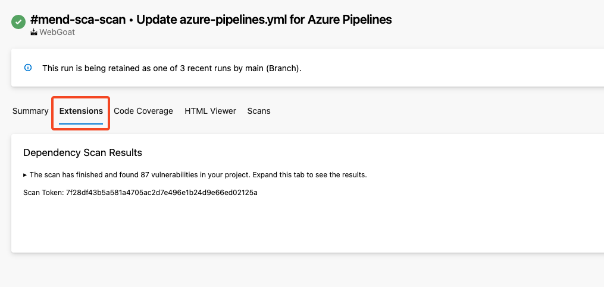
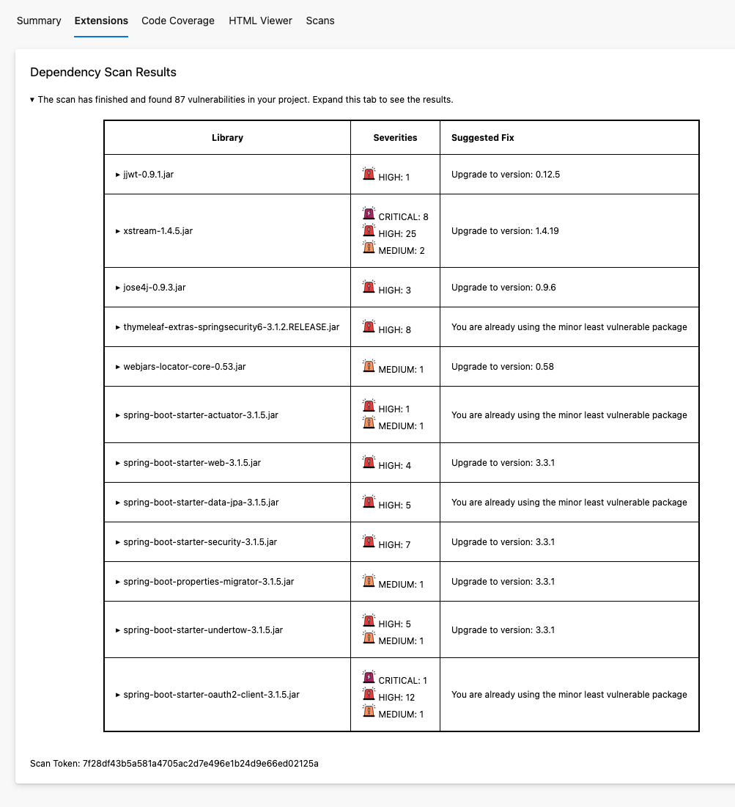

# Creating HTML Reports for Azure DevOps Pipelines

Azure DevOps pipelines have a way of publishing Markdown/HTML reports and making these appear as part of an "Extensions" tab in the Pipeline. 

To do this, users must follow the following steps:
- Create a markdown file with the ".md" extension. This can contain HTML if required.
- Upload that markdown file as a summary using the AZDO Logging command: ``echo "##vso[task.uploadsummary]/path/to/markdown_file.md"``
- Upload that markdown file as an artifact as well, otherwise it will not be retained to later show in the "Extensions" tab.

This process can be used to run an API request, and then build an HTML report from the data retrieved. This repository shows an example of some templates that run a Mend SCA scan, and then sends an API request to Mend servers to get results from the scan. It then formats that data into HTML to display like below:

From there, the dependency scan results section can be expanded to show the actual results of the scan:

